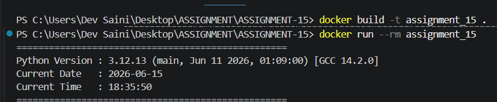

# Dockerized Python Version Application

A simple Dockerized Python application built using the `python:3.12-slim` base image.

## Features

* Displays the Python version running inside the container
* Displays the current date and time

## Project Structure

```text
docker-python-version-app/
├── app.py
├── Dockerfile
├── README.md
└── screenshot.png
```

## Build the Image

```bash
docker build -t assignment_15 .
```

## Run the Container

```bash
docker run --rm assignment_15 
```

## Sample Output

```text
==================================================
Python Version : 3.12.13
Current Date   : 2026-06-15
Current Time   : 18:33:06
==================================================
```

## Screenshot



## Base Image

```dockerfile
python:3.12-slim
```

## Author

Shekhar Saini
